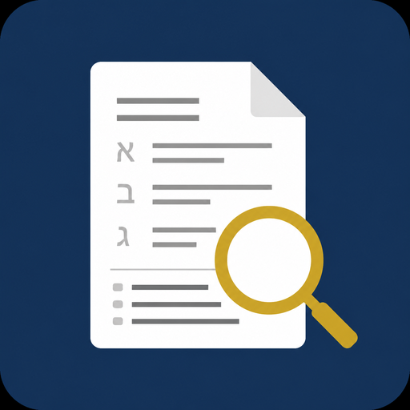

<p align="center">
  
</p>

<h1 align="center">PDF Catalog</h1>

<p align="center">
  Local, offline search for Hebrew and English PDFs.<br>
  Point it at a folder. It reads, OCRs, and catalogs every document on your machine.
</p>

<p align="center">
  <a href="https://github.com/Dor-Peretz/PDF-Catalog"></a>
  
  
</p>

## Description

**PDF Catalog** is a desktop-style local web app for people who keep contracts, invoices, scans, and study PDFs on disk — especially in Hebrew.

Give it a folder. It walks every subfolder, finds `*.pdf` files, extracts text (or OCRs scans), then stores keywords, categories, dates, and language in a local SQLite index. After that you can search, filter, and open the original file. Nothing is uploaded. The UI binds to `127.0.0.1` only.

It is meant to feel like a serious Windows document tool: fast, calm, practical. Not a cloud product.

## Features

- Recursive folder scan (optional: selected folder only)
- Digital PDF text extraction plus OCR for scans
- Hebrew + English OCR (`heb+eng`), including CamScanner-style pages
- Automatic keywords, dates, and categories (invoice, contract, report, receipt, and more)
- Full-text search with filters for category, language, and OCR status
- List and table views, plus a document details inspector
- In-app folder browser
- Unchanged files are skipped by SHA-256

## Requirements

- Python 3.10+
- [Tesseract OCR](https://github.com/UB-Mannheim/tesseract/wiki) (the app ships Hebrew and English `tessdata` under `data/tessdata/`)

Poppler is optional. Page rendering uses PyMuPDF, so scanned PDFs work without Poppler.

### Windows: Tesseract

1. Install from [UB Mannheim Tesseract](https://github.com/UB-Mannheim/tesseract/wiki).
2. Default path: `C:\Program Files\Tesseract-OCR\tesseract.exe`.
3. If it is installed elsewhere, set `TESSERACT_CMD` to that `tesseract.exe`.

## Run

```powershell
python -m venv .venv
.\.venv\Scripts\Activate.ps1
pip install -r requirements.txt
python -m app
```

Open [http://127.0.0.1:8765](http://127.0.0.1:8765)

1. Click **Browse** and choose a folder of PDFs, or paste the path in the top bar.
2. Click **Index Folder**. Unchanged files are skipped.
3. Search in Hebrew or English, filter by category, and open the original PDF.

The index lives in `data/catalog.db`. Settings stay in `data/settings.json`. Both stay on this computer.

## What is stored

- Path, filename, size, modified time, SHA-256
- Page count, OCR vs native text, detected language
- Full extracted text
- Keywords (Hebrew stopwords removed)
- Category: חשבונית, קבלה, חוזה, תעודה, מכתב, דוח, or אחר
- Dates found in the document

## License

Private repository. All rights reserved unless otherwise noted.
